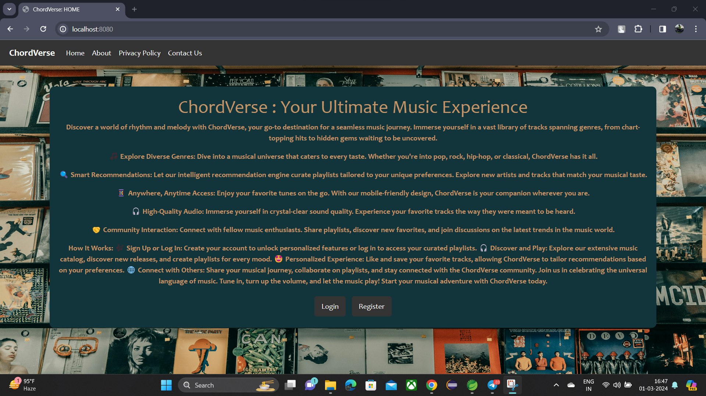
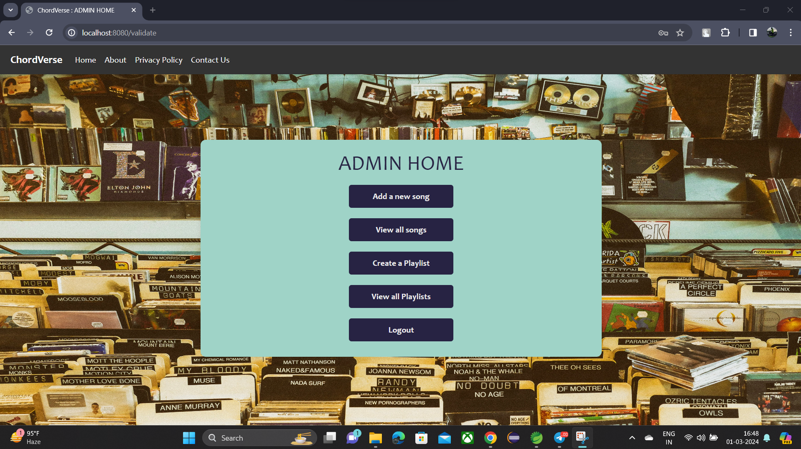
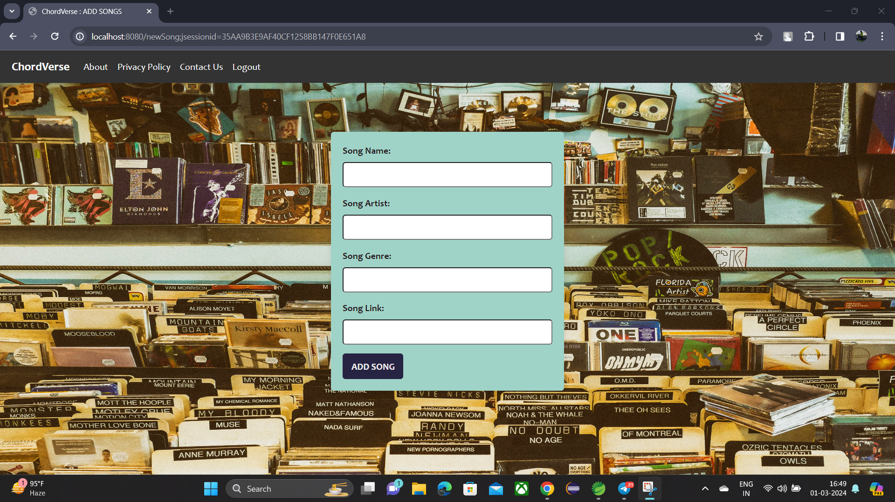
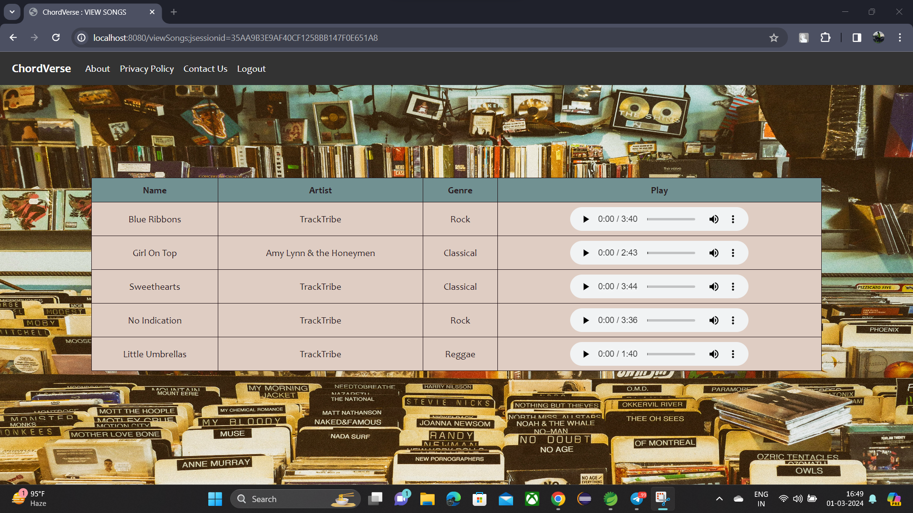
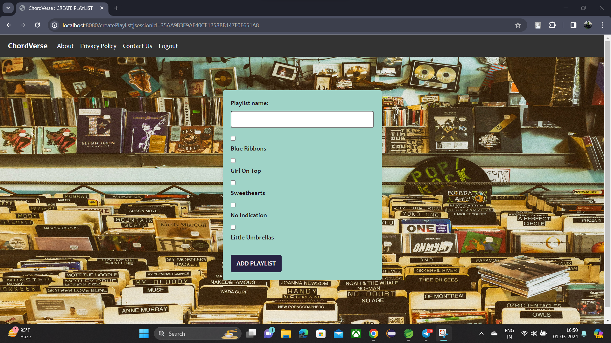
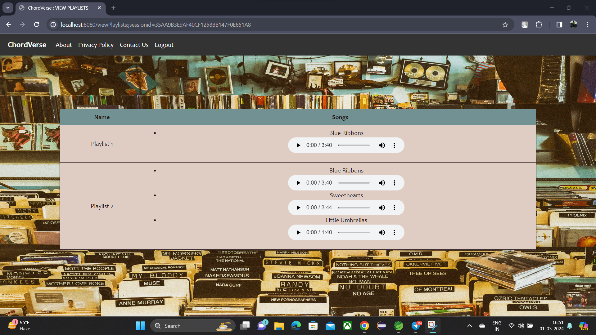
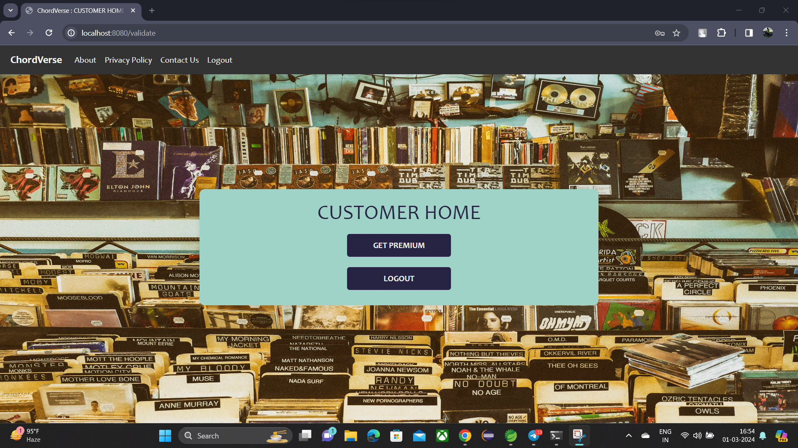

# ChordVerse Music Streaming App

ChordVerse is a music streaming application built on the Spring Boot framework. It allows users to listen to a wide range of songs, create playlists, and enjoy a seamless music experience. Admins can manage songs, playlists, and user accounts efficiently.

## Features

- User Authentication: Users can sign up, log in, and securely access their accounts.
- Song Management: Admins can add new songs, update song details, and remove songs from the platform.
- Playlist Creation: Users can create custom playlists by adding songs from the available library.
- Payment Integration: Users can subscribe to premium plans for ad-free listening and access to exclusive content.
- Responsive Design: The application is optimized for various devices, including desktops, tablets, and smartphones.

## Technologies Used

- Java
- Spring Boot
- Spring Security
- Hibernate
- MySQL
- Thymeleaf (for server-side templating)
- HTML/CSS/JavaScript (for frontend)

## Installation

### 1. Clone the repository:

 ```bash
    $ git clone https://github.com/Guruprasath-K/chordverse-springboot.git
 ```

### 2. Navigate to the project directory:

 ```bash
    $ cd chordverse-springboot
 ```

### 3. Configure the database settings in `application.properties`.

### 4. Running with Eclipse:
- Open Eclipse IDE.
- Select `File` > `Import`.
- In the import dialog, choose `Existing Maven Projects`.
- Browse to the cloned repository directory and select it.
- Click `Finish` to import the project into Eclipse.
- Right-click on the project in the `Project Explorer` and select `Run As` > `Spring Boot App`.
- Access the application in your web browser at `http://localhost:8080`.

## Usage

### 1. As an Admin:
- Log in with admin credentials.
- Manage songs: Add new songs, update song details, or delete songs.
- Create curated playlists for users to enjoy.

### 2. As a User:
- Sign up for an account or log in.
- Search for songs, albums, or artists.
- Create personalized playlists.
- Subscribe to premium plans for an enhanced music experience.

## Contributing

Contributions are welcome! If you'd like to contribute to ChordVerse, please fork the repository and submit a pull request.

## Screenshots


<br/>

<br/>

<br/>

<br/>

<br/>

<br/>

<br/>

## License

This project is licensed under the [MIT License](LICENSE).

## Support

For support or inquiries, please contact us at support@chordverse.com.
